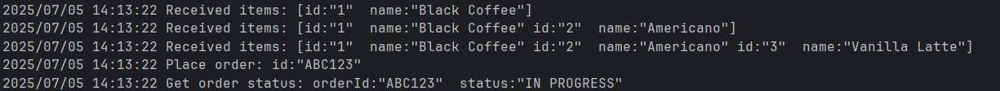

# gRPC Go Coffee Shop Example

This project demonstrates a simple client-server application using gRPC in Go. It simulates a basic coffee shop where a client can fetch a menu, place an order, and check the order status.

## Overview

The repository contains two main components:
* `server.go`: A gRPC server that implements the `CoffeeShop` service. It handles requests for the menu, new orders, and order statuses.
* `client/client.go`: A gRPC client that communicates with the server. It fetches the menu, places an order using the received menu items, and then checks the status of that order.

The communication protocol is defined using Protocol Buffers in `coffee_shop.proto`.

## Prerequisites

Make sure you have the following installed:
* **Go:** Version 1.18 or higher
* **Protocol Buffers:** The `protoc` compiler
* **Go gRPC plugins:** Install with:

```bash
go install google.golang.org/protobuf/cmd/protoc-gen-go@latest
go install google.golang.org/grpc/cmd/protoc-gen-go-grpc@latest
```

Ensure your `$GOPATH/bin` is in your system's `PATH`.

## Installation & Setup

1. **Clone the repository:**
```bash
git clone https://github.com/kevinfjq/grpc-go-test.git
cd grpc-go-test
```

2. **Generate Go code from proto file:**
```bash
make start_build_proto
```
Or manually:
```bash
mkdir coffeeshop_proto
protoc --go_out=./coffeeshop_proto --go_opt=paths=source_relative --go-grpc_out=./coffeeshop_proto --go-grpc_opt=paths=source_relative coffee_shop.proto
```

3. **Download dependencies:**
```bash
go mod tidy
```

## Usage

1. **Start the gRPC Server:**
```bash
go run server.go
```
The server will start listening on port `9001`.

2. **Run the gRPC Client (in a separate terminal):**
```bash
go run client/client.go
```

The client will connect to the server, request the menu, place an order with all items from the menu, and display the order status.

## Expected Output



The client will display the streaming menu items as they're received, followed by the order placement and status check.
## Services

The `CoffeeShop` service provides three RPC methods:
* `GetMenu`: Returns a stream of menu items
* `PlaceOrder`: Places an order and returns a receipt
* `GetOrderStatus`: Checks the status of an order using the receipt
